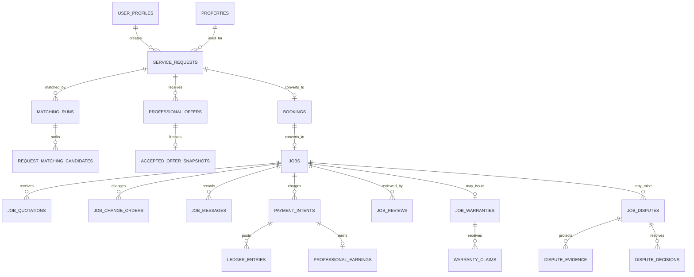

# Phase 2 Data Model

The database is normalized around the service journey. Every user-facing or sensitive table has Row Level Security, and multi-record state changes run through controlled PostgreSQL functions.

Money is stored as integer minor units with an ISO currency code. UTC is authoritative; displays use Asia/Karachi. Submitted quotations, audit records, accepted commercial snapshots, ledger entries, dispute evidence, and status histories are append-only or corrected through new records rather than overwritten.

Operational tables add explainable `marketplace_risk_signals`, `operational_alerts`, `background_job_runs`, `data_retention_policies`, and user-submitted `marketplace_abuse_reports`. Signals are review aids only and never create an automatic opaque ban.
