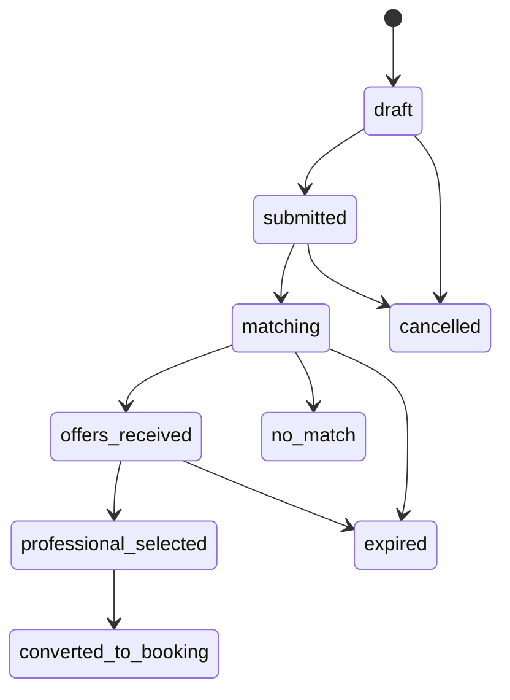
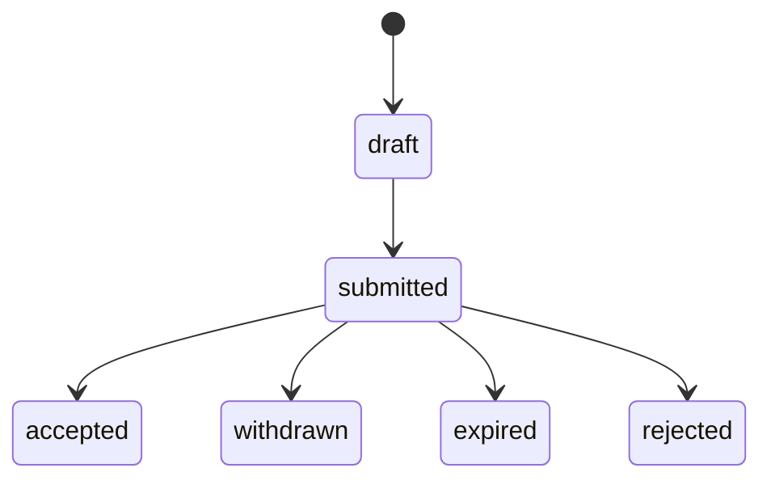
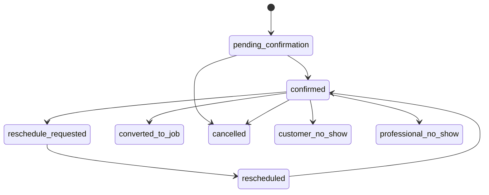
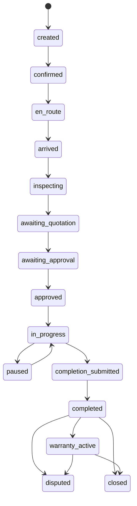
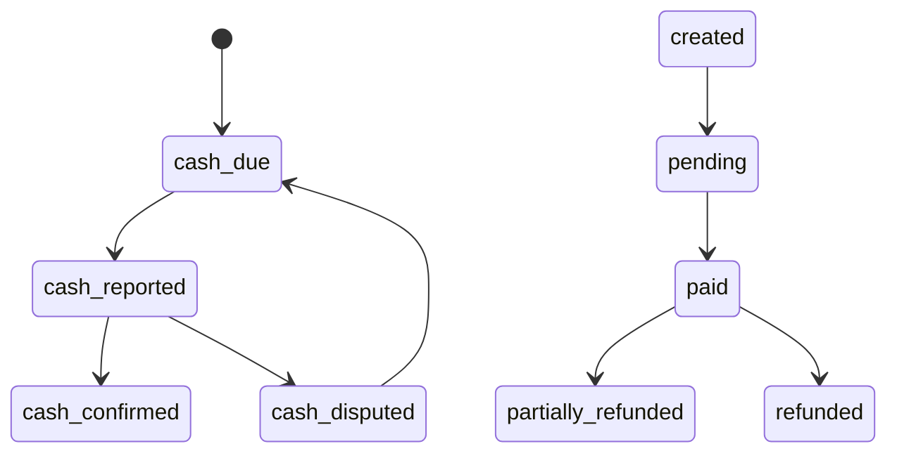
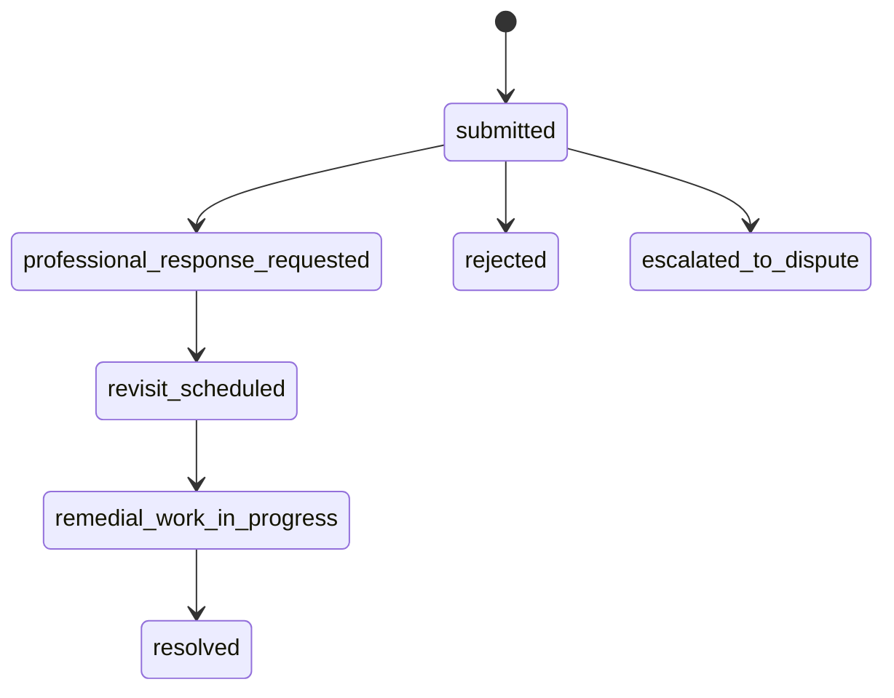
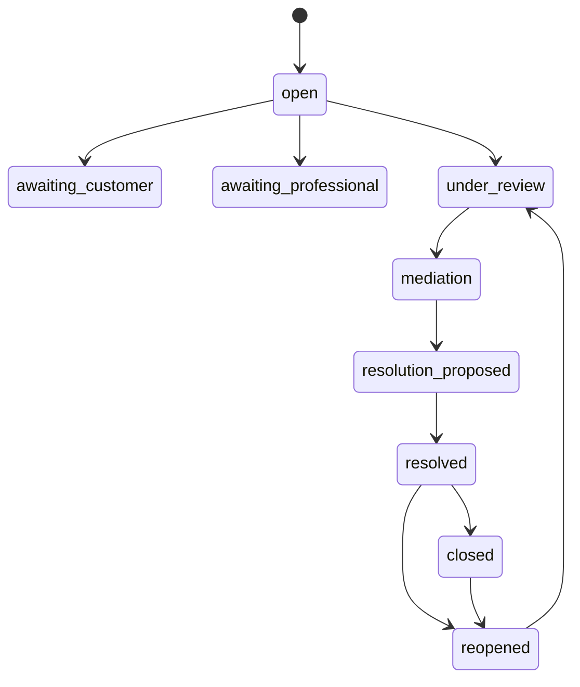

# Marketplace State Machines

Database functions are authoritative. UI buttons and realtime updates never bypass these transitions.

## Request and offer

## Booking and job

## Payment, warranty and dispute

